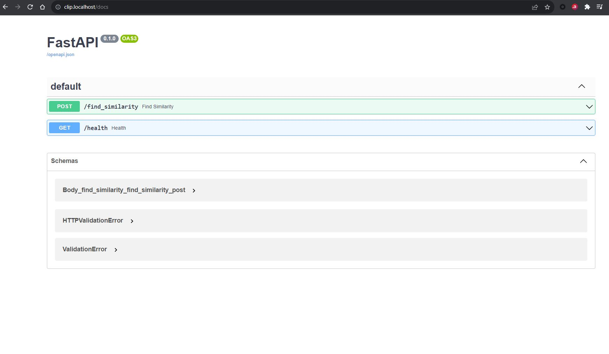

# CLIP deploy using FastAPI using MiniKube Cluster

Given an Image and a list of comma separated texts the Model returns Probabilities for each text showing which text is more similar to the image.


![fastapi[all]](https://img.shields.io/badge/fastapi[all]-0.98.0-green)

## Docker Image

Build docker image: `docker build --tag clip-k8s .`  
Run docker image: `docker run -it --rm -p 80:80 clip-k8s:latest`

## How to run the code
- Start MiniKube with local docker desktop

Tick mark on `Enable Kubernetes` in Kubernetes option of docker desktop settings.

Run `minikube start --driver=docker` to start minikube cluster.

- Create the Deployment: 
```
# Load docker image to minikube
minikube image load clip-fastapi:latest

# Check the images in minikube 
minikube image ls

# Create deployment
kubectl apply -f .

# Check status of all pods
kubectl get all
```

- Tunnel to the Ingress

To use Ingress in Minikube, enable addons by running below commands:

```
minikube addons enable ingress
minikube addons enable dashboard
minikube addons enable metrics-server
```
Now tunnel the minikube node to localhost: `minikube tunnel`

- Access the FastAPI docs page: `clip.localhost/docs`


## Steps to check details

- Get details of deployment
```
kubectl describe deployment clip-deployment
```

- Get details of the pods
```
kubectl describe pod/clip-deployment-75f7fb8487-dscph
```

- Get details of the ingress
```
kubectl describe incress clip-ingress
```

- Check for CPU and Memory usage by each pod
```
kubectl top pod
```

- Check details of node(s)
```
kubectl top node
```

- Get details of all yaml configuration
```
kubectl get all -A -o yaml
```

## Group Members
- Aman Jaipuria
- Anurag Mittal
